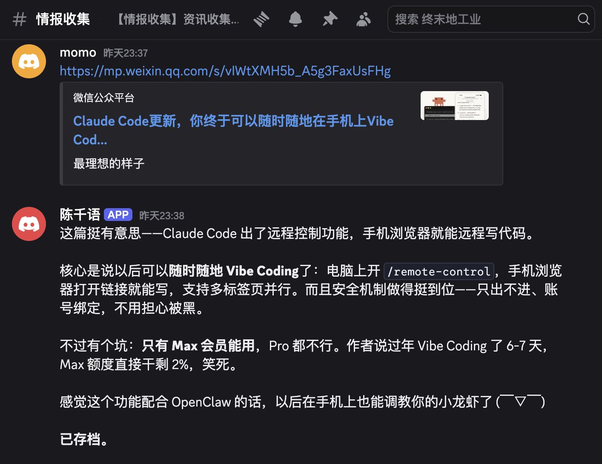
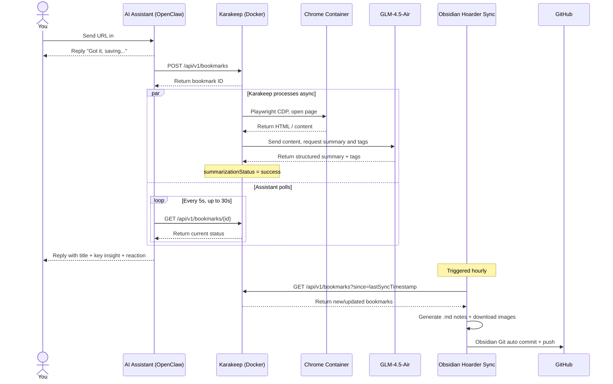

<div align="center">

# Personal Content Pipeline

<p>
  
  
  
</p>

**Drop a link in Discord. Get an AI summary in 30 seconds. Synced to Obsidian automatically.**

[中文版](README.zh.md)

</div>

---

This repo is a setup guide, not a runnable program.

Honestly, after years of reading articles I can't remember, and bookmarks I never open again, I spent some time wiring a few existing tools together: drop a link in a Discord channel, and an AI assistant (OpenClaw) submits it to Karakeep — a self-hosted bookmarking service that crawls the page, calls GLM-4.5-air to generate a Chinese summary, then replies in Discord within 30 seconds. The bookmark syncs to Obsidian automatically.

It worked well enough that I decided to write it up.

<div align="center">
  
</div>

> **Platform support:** Primarily tested with **WeChat Official Account articles**. General websites (English articles, blogs, news) work too. Xiaohongshu (Little Red Book) is not supported yet — its web version requires login, which Karakeep can't handle directly.

**This is not an out-of-the-box tool.** You'll need to run some commands, fill in some configs, and hit a few snags I've already documented in the appendix.

If you:

- habitually save articles you never open again
- want AI to help process your information stream but don't know where to start
- are fine with some setup work, but don't want to figure everything out from scratch

then this guide might save you some time. Following it won't guarantee an exact replica of my setup, but it should get you most of the way there.

---

## System Overview

Four layers, each doing one thing:

| Layer | Component | Responsibility |
|---|---|---|
| Interaction | Discord + AI assistant (OpenClaw) | Receive URLs, report summaries |
| Processing | Karakeep (Docker) | Crawl content, AI summarization |
| Knowledge base | Obsidian + Hoarder Sync | Local Markdown notes, hourly sync |
| Backup | Obsidian Git + GitHub | Automatic versioning and cloud backup |

## Flow Diagram



---

## Prerequisites

Before starting, confirm you have:

- macOS with Docker Desktop installed
- ZhipuAI account and API Key (free registration: https://open.bigmodel.cn)
- Obsidian installed

> **On model selection:** New ZhipuAI accounts can use `glm-4.5`, `glm-4.5-air`, `glm-4.6`, etc. `glm-4.5-air` offers the best value. `glm-4-flash` and `glm-4-long` mentioned in some older docs are not available on new accounts.

---

## Step 0: Set Up Discord Bot

This is done in the browser — no command line needed. A few things are easy to miss.

### 0.1 Create the Bot

1. Go to https://discord.com/developers/applications → **New Application**, enter a name → Create
2. Left sidebar → **Bot** → click **Reset Token** → copy and save it (**shown only once**)

### 0.2 Enable Required Intents

Scroll down to **Privileged Gateway Intents** and enable:

| Intent | Why |
|---|---|
| **Message Content Intent** | **Required** — without this, the bot can't read message content |
| **Server Members Intent** | Recommended for member permission control |

I missed Message Content Intent the first time. The bot started fine but received nothing — took me a while to track down.

### 0.3 Invite the Bot to Your Server

1. Left sidebar → **OAuth2** → **URL Generator**
2. **Scopes**: check `bot` and `applications.commands`
3. **Bot Permissions**: check `View Channels`, `Send Messages`, `Read Message History`, `Embed Links`, `Attach Files`
4. Copy the generated URL, open it in a new tab
5. Select your server → **Authorize** (requires server admin)

---

## Step 1: Deploy Karakeep

Karakeep is the core of the system — it crawls content, generates summaries, and stores everything. Runs via Docker with three containers (web, chrome, meilisearch). Get the `.env` right and it mostly just works.

### 1.1 Create Config Files

```bash
mkdir -p ~/karakeep && cd ~/karakeep
curl -o docker-compose.yml https://raw.githubusercontent.com/karakeep-app/karakeep/main/docker/docker-compose.yml
```

Generate two random secrets:

```bash
openssl rand -base64 36  # for NEXTAUTH_SECRET
openssl rand -base64 36  # for MEILI_MASTER_KEY
```

Create `.env` — every field here has a purpose, don't skip any:

```env
KARAKEEP_VERSION=release
NEXTAUTH_SECRET=<first secret>
MEILI_MASTER_KEY=<second secret>
NEXTAUTH_URL=http://localhost:3000

# Critical: bypass SSRF protection blocking Clash fake-ip (see appendix)
CRAWLER_ALLOWED_INTERNAL_HOSTNAMES=.

# ZhipuAI GLM config
OPENAI_API_KEY=<your ZhipuAI API Key>
OPENAI_BASE_URL=https://open.bigmodel.cn/api/paas/v4
INFERENCE_TEXT_MODEL=glm-4.5-air
INFERENCE_IMAGE_MODEL=glm-4.5-air
INFERENCE_OUTPUT_SCHEMA=plain
INFERENCE_LANG=chinese
INFERENCE_ENABLE_AUTO_SUMMARIZATION=true
INFERENCE_CONTEXT_LENGTH=8192
INFERENCE_MAX_OUTPUT_TOKENS=4096
INFERENCE_JOB_TIMEOUT_SEC=120
CRAWLER_STORE_SCREENSHOT=false
```

> **Note:** **`INFERENCE_OUTPUT_SCHEMA` must be `plain`**, not `json`. The GLM-4.5 series will literally output `{"answer":"..."}` and your summaries will show as raw JSON strings. Spent a while on this one.

> **Note:** **Do not set `HTTP_PROXY`/`HTTPS_PROXY`**. When Clash is unstable it accepts TCP connections then immediately drops the CONNECT tunnel, causing all crawling to fail. `CRAWLER_ALLOWED_INTERNAL_HOSTNAMES=.` already handles the network issue — no proxy needed.

### 1.2 Start Services

```bash
docker compose up -d
docker compose ps  # confirm all three containers (web, chrome, meilisearch) are Up
```

Visit http://localhost:3000 and register an account.

### 1.3 Create API Key

1. Web UI → Settings → API Keys
2. Click "Create new API key"
3. Copy and save it (shown only once)

### 1.4 Verify

Run this to confirm Karakeep is receiving requests:

```bash
curl -X POST http://localhost:3000/api/v1/bookmarks \
  -H "Authorization: Bearer <your-api-key>" \
  -H "Content-Type: application/json" \
  -d '{"type": "link", "url": "https://example.com"}'
```

If the response contains an `"id"` field, you're good.

---

## Step 2: Configure Obsidian

This step syncs Karakeep's content to Obsidian and optionally backs your vault up to GitHub.

### 2.1 Install Plugins

Obsidian disables third-party plugins by default. Unlock first: Settings → Community Plugins → disable **Safe mode** → **Turn on community plugins**

Then go to Browse and install:

- **Hoarder Sync**: syncs bookmarks from Karakeep to Obsidian
- **Obsidian Git**: auto-pushes your vault to GitHub (configured in step 2.4)

### 2.2 Configure Hoarder Sync

| Setting | Value |
|---|---|
| API Key | The key from step 1 |
| API Endpoint | `http://localhost:3000/api/v1` |
| Sync Folder | `00 Inbox` (or whatever folder you prefer) |
| Sync Interval | `60` (minutes) |
| Update Existing Files | **Enable** |

> ⚠️ **"Update Existing Files" must be enabled.** Otherwise notes get created before AI processing finishes, and the summary never gets written in. This is off by default — easy to miss.

### 2.3 Verify

Run **Hoarder Sync: Start Sync** from the command palette and check if `.md` files appear in your sync folder.

### 2.4 Configure Obsidian Git (Auto-backup to GitHub)

This backs up your entire vault to GitHub. Not required for the core system to work, but worth doing.

#### 2.4.1 Create a Private GitHub Repo

Go to GitHub → New repository, pick a name, set it to **Private**, don't initialize with any files.

#### 2.4.2 Generate SSH Key and Add to GitHub

```bash
ssh-keygen -t ed25519 -C "your@email.com"
cat ~/.ssh/id_ed25519.pub  # copy this output
```

Go to GitHub → Settings → **SSH and GPG keys** → **New SSH key**, paste the public key.

#### 2.4.3 Initialize Vault as Git Repo

```bash
cd ~/your-vault           # replace with your Obsidian vault path
git init
git remote add origin git@github.com:<username>/<repo-name>.git
```

#### 2.4.4 Configure the Plugin

Obsidian → Settings → **Obsidian Git**:

| Setting | Value |
|---|---|
| Auto Commit Interval | `5` (minutes, 0 to disable) |
| Auto Push | **Enable** |

For the first time, run **Obsidian Git: Commit all changes** from the command palette to verify the SSH connection works.

---

## Step 3: Configure AI Assistant (OpenClaw)

This step tells the Discord AI assistant what to do when it receives a URL. I'm using OpenClaw — if you use a different method to submit URLs, skip this and adapt the logic.

### 3.0 Install OpenClaw

```bash
brew install openclaw
```

Configure Discord channel:

```bash
openclaw config
```

In the interactive wizard: select channel type → **Discord** → enter the bot token from step 0 → allow all channels.

Install and start the gateway service:

```bash
openclaw gateway install
openclaw gateway start
```

Verify: mention the assistant in a Discord channel — if it responds, you're set. If not, run `openclaw gateway status` to check the service.

### 3.1 Create a Dedicated Channel in Discord

Create a new channel specifically for dropping links to save, separate from regular chat.

### 3.2 Configure AI Assistant Behavior

The behavior config goes into two files: **TOOLS.md** for execution steps, **AGENTS.md** for trigger conditions and reply rules.

#### TOOLS.md: Execution Steps

Append to `~/.openclaw/workspace/TOOLS.md`:

```markdown
## Intel Channel → Karakeep

**Channel:** `intel` (Discord channel ID: <your channel ID>)

### Flow

**Step 1: Reply immediately** (don't wait for exec to finish — send first)

**Step 2: Run the submit script via exec**

exec params:
- command: submit script below
- yieldMs: 10000
```

**Submit script** (exec 1 — exits as soon as it gets the ID, doesn't wait for AI processing):

```bash
API="<your-karakeep-api-key>"
URL_TO_SAVE="[URL from user message]"

ID=$(curl -s -X POST http://localhost:3000/api/v1/bookmarks \
  -H "Authorization: Bearer $API" \
  -H "Content-Type: application/json" \
  -d "{\"type\": \"link\", \"url\": \"$URL_TO_SAVE\"}" \
  | python3 -c "import sys,json; print(json.loads(sys.stdin.buffer.read().decode('utf-8'), strict=False).get('id',''))")

echo "BOOKMARK_ID: $ID"
```

Continue appending to TOOLS.md:

```markdown
**Step 3: Once you have BOOKMARK_ID, immediately run the poll script via a second exec**

exec params:
- command: poll script below (replace BOOKMARK_ID_HERE with the ID from step 2)
- yieldMs: 60000
```

**Poll script** (exec 2 — checks every 5 seconds, up to 30 seconds):

```bash
API="<your-karakeep-api-key>"
ID="BOOKMARK_ID_HERE"

i=0
while [ $i -lt 6 ]; do
  sleep 5
  DATA=$(curl -s "http://localhost:3000/api/v1/bookmarks/$ID" \
    -H "Authorization: Bearer $API")
  STATUS=$(echo "$DATA" | python3 -c "import sys,json; print(json.loads(sys.stdin.buffer.read().decode('utf-8'), strict=False).get('summarizationStatus',''))")
  if [ "$STATUS" = "success" ]; then
    echo "$DATA" | python3 -c "
import sys, json, re
d = json.loads(sys.stdin.buffer.read().decode('utf-8'), strict=False)
title = (d.get('content',{}).get('title') or '').strip()
summary = (d.get('summary') or '').strip()
tags = [t['name'] for t in d.get('tags', [])]
m = re.search(r'\*\*核心主张\*\*\s*\n(.*?)(?=\n\n|\*\*)', summary, re.DOTALL)
zhuchang = m.group(1).strip() if m else ''
print('TITLE:', title)
print('ZHUCHANG:', zhuchang)
print('TAGS:', ', '.join(tags))
print('---FULL---')
print(summary)
"
    break
  fi
  i=$((i+1))
done
```

Continue appending to TOOLS.md:

```markdown
**Step 4: Once you have the output, send a second message**

- TITLE → article title
- ZHUCHANG → core argument (paraphrase in your own words, don't copy verbatim)
- FULL → full summary; read it and add your own reaction
- If still pending after 30s → reply "Saved it, AI is still processing — Obsidian will have it shortly"
```

> ⚠️ **The two execs must run separately.** Combining them into one exec will block the Discord message listener past the 30-second hard timeout, leaving the assistant unresponsive for a long time.

#### AGENTS.md: Trigger Conditions and Reply Rules

Append to `~/.openclaw/workspace/AGENTS.md`:

```markdown
## Intel Channel: Auto-save

When a message arrives in the **intel** channel, no trigger word needed — execute the following flow directly.

### URL messages

**Step 1: Reply immediately** (don't wait for processing)

**Step 2: Run both exec scripts from TOOLS.md "Intel Channel → Karakeep"**

**Step 3: Once summary is ready, send a second message** with three parts:
1. What the piece is actually about, in your own words (not a copy of the summary)
2. A genuine reaction — resonance, skepticism, connection to something else. Have an opinion. No filler.
3. A final line noting it's been archived and will sync to Obsidian shortly

Vary your reactions based on the content. Don't let every reply sound like it came from the same template.

### Prohibited:
- Do not fetch content yourself via WebFetch or browser
- Do not push files to GitHub yourself
```

---

## FAQ

A few questions I've thought about or been asked while building this.

### Architecture

### Q1. Why introduce Karakeep instead of handling everything with agents?

I thought about this too. Agents are great for one-off tasks, but this system needs things agents can't naturally provide:

| Capability | Karakeep provides | Pure agent approach |
|---|---|---|
| Content crawling (JS rendering) | Playwright headless browser | WebFetch can't render JS |
| AI summarization | Async queue, background processing | Real-time wait, doubled API cost |
| Data persistence | PostgreSQL | None — data gone when session ends |
| Full-text search | Meilisearch built-in | Doesn't exist |
| Obsidian sync | Plugin integration | Would need custom development |
| Mobile / browser extension | Official support | None |

The short version: Karakeep is infrastructure — responsible for "what to store, how to process it, where it goes." The AI assistant is the interaction layer — "receive instruction, report result." The assistant's 30 seconds is just submit + poll + format reply. The actual crawling and summarization runs in Karakeep's async queue, independent of whether the assistant is even online.

### Q5. The two-exec pattern exists because of a 30-second timeout. Doesn't that indicate a design problem?

It indicates a platform constraint from Discord's API, not a problem with this approach. All Discord bot frameworks face the same soft timeout. Splitting polling into a separate exec is a normal response to that constraint.

The real improvement would be having Karakeep webhook-notify the assistant when processing completes, rather than having the assistant poll. Karakeep supports webhooks — just haven't set it up yet.

---

### Tool Choice

### Q2. Why not use Pocket / Instapaper / Readwise and skip the self-hosting?

Honestly, for most people, **Readwise Reader is probably the better choice**.

Readwise Reader has a mobile app, browser extension, highlighting, RSS, AI summaries, full-text search — far more complete than anything self-hosted, at $19.99/month.

The real advantages of self-hosting are only three:

- **Data ownership**: everything is local, no dependency on any subscription staying alive
- **Full customization**: summary prompts, reply format, trigger behavior — all tweakable
- **Cost**: only GLM API usage fees, which for personal use runs a few RMB per month

If those three things don't matter to you, Readwise is easier. Choosing to self-host is a values decision, not a technical superiority claim.

---

### AI Quality

### Q3. How accurate are the summaries? Can they get facts wrong?

Yes, they can. There's data on this.

From the Vectara Hallucination Leaderboard (2025, standardized summarization task on 831 CNN/Daily Mail documents):

| Model type | Hallucination rate |
|---|---|
| Current best models | ~1.8% |
| Mainstream models average | 3–8% |
| Multi-document summarization worst case | up to 75% |

GLM-4.5-air is a mid-tier model — single-document hallucination rate is probably in the 5–10% range.

But this needs context: these summaries are an **entry-point filter**, not a replacement for the original. The assistant's reply helps you decide "is this worth opening and reading" — not "can I cite this summary as fact." If you'd use AI summaries as factual sources, that's a usage problem, not a system problem.

### Q4. How well does GLM handle English content — nuance, irony, tone?

Can't guarantee it — honestly. GLM is a Chinese-optimized model. For English content it tends to fail in these specific scenarios:

- **Irony and humor**: reads literally, misses the tone
- **Hedging language**: compresses "research suggests it might" into "research proves"
- **Technical terms**: occasionally substitutes near-synonyms that shift the precise meaning

Purely factual pieces (news, technical docs) tend to be accurate. Opinion pieces, culturally-specific writing, and satire carry more risk.

---

### Limitations

### Q6. Why is the summary format fixed at "core argument + tags"? Different content types need different formats.

This is a genuine limitation and something I know should be improved.

Fixed format was the fastest thing to get working. A more sensible approach would be dynamic formatting by content type:

- Academic paper → method + conclusion + limitations
- Product review → pros/cons + who it's for
- News → event + different positions
- Opinion piece → core argument + evidence + room for rebuttal

Karakeep's summary prompt lives in `packages/shared/prompts.ts` in the source — it can be edited directly. Just hasn't been done yet.

### Q7. After saving a lot of articles, can I ask the assistant "what contradicts what I saved last week"?

Not automatically, right now.

What works: manually trigger a search — `@assistant have I saved anything about X` → semantic search → returns related items → you ask follow-up questions to compare. What doesn't work: automatically detecting contradictions between two articles and proactively surfacing them. That would require cross-referencing new content against history at save time. It's a missing feature, not a design philosophy.

### Q8. Tags are generated independently by GLM each time, with no global taxonomy. Won't they become a mess?

Yes, and this is one of the most obvious weaknesses of the current system.

The same concept can end up tagged as "machine learning", "机器学习", and "ML" — and there's no way to connect them for search or filtering. Workable fix: inject the existing tag list into the summary prompt so GLM reuses tags it's already seen. Or run a periodic agent task to cluster and merge synonymous tags. Known issue, not fixed yet.

### Q9. The system is one-directional: you send URLs, it archives. Why no reverse push?

This is a real missing feature. "This article got a follow-up" style notifications require periodically checking saved URLs for updates and tracking author new posts — outside the current system's scope. OpenClaw has a heartbeat mechanism that could support this, but monitoring all saved articles for updates has a non-trivial cost. Not prioritized yet.

---

### Knowledge Management

### Q10. This system collects data, not knowledge. After a thousand articles, can you ask "where are my blind spots"?

Not directly, and this is the most important thing to stay cautious about.

There's a psychological concept called the **Collector's Fallacy**: the brain conflates "collecting" with "learning." The act of saving triggers a dopamine release and a sense of task completion — but nothing was actually internalized. Japanese has a word for it: **積ん読 (Tsundoku)** — buying books and letting them pile up unread. This system is very likely a digital version of Tsundoku.

The system can reduce the friction of saving. The friction of actually processing what you saved is yours to bear. If you never open your Obsidian notes, this is just a more elaborate browser bookmarks folder.

### Q11. Markdown + GitHub feels outdated. Why not a vector database for semantic search?

Markdown + Git is a deliberate constraint, not technical lag.

Vector databases genuinely do semantic search better — but the tradeoff is data that can't be read or written by humans, hard to debug, and expensive to migrate away from. The practical middle ground is both: Markdown stores the raw notes, a vector index (memsearch) is built on top. That's what the current system already does.

The core value of Markdown + Git is: **you can open your knowledge base and just read it.** If your knowledge base is pure vectors, your trust in it and actual usage rate will drop. Readability is itself an important metric for knowledge management tools.

### Q12. If there's an AI assistant, why still require manually sending URLs? The assistant should monitor RSS and Twitter automatically.

The manual URL submission is intentional friction.

The real problem with automated collection is that RSS unread counts explode, and you eventually hit "mark all as read" and abandon the tool entirely. Manually sending a URL means you've already made a judgment: "this is worth saving." That judgment is itself an act of information filtering, and a shallow form of cognitive engagement that actually aids retention.

Automated RSS monitoring could be added as a feature — but then you have to face "do I actually want to read all this stuff that auto-saved?" The value of a collection isn't in its size. It's in whether you'll actually use it.

---

## Roadmap

The system is usable as-is. These are improvements identified from actual use, roughly ordered by difficulty. Some I know exactly how to implement and just haven't done. Some I haven't fully thought through.

### Near-term (config / prompt level, no new services needed)

- [ ] **Webhook instead of polling**: configure Karakeep webhooks so it notifies the assistant on completion — eliminates exec 2 wait time
- [ ] **Dynamic summary format by content type**: edit `packages/shared/prompts.ts` so GLM uses different output structure for papers, reviews, news, opinion pieces
- [ ] **Inject global tag list**: include existing tags in the summary prompt so GLM reuses them — reduces tag fragmentation

### Medium-term (requires new functionality)

- [ ] **Cross-article semantic comparison**: on save, cross-reference new content against history, automatically flag related or contradicting articles
- [ ] **Reverse push**: use heartbeat to periodically check saved articles for updates, proactively push follow-ups
- [ ] **Periodic tag consolidation**: run a scheduled agent task to cluster all tags, merge synonyms

### Long-term (architectural expansion)

- [ ] **Automated RSS / Twitter monitoring**: subscribe to sources, let the assistant filter by interest model and auto-save, replacing fully manual submission
- [ ] **Knowledge gap analysis**: based on tag distribution across saved content, identify sparsely covered topic areas, generate periodic reports

---

## References

- [Karakeep Documentation](https://docs.karakeep.app)
- [Karakeep GitHub](https://github.com/karakeep-app/karakeep)
- [Obsidian Hoarder Sync Plugin](https://github.com/jhofker/obsidian-hoarder)
- [ZhipuAI Open Platform](https://open.bigmodel.cn)

---

## Appendix: Troubleshooting

Following the steps above should avoid most of these. But if something breaks, check here first.

### A1. All URL crawling fails: SSRF protection rejecting reserved IPs

**Symptom:** All `crawlStatus` values are `failure`, logs show:
```
Refusing to access disallowed resolved address 198.18.x.x for host xxx.com
```

**Cause:** Karakeep has built-in SSRF protection that does DNS resolution before crawling. Clash Verge uses `198.18.0.0/16` as its fake-ip pool by default. Docker containers inherit the host's DNS, so external domains resolve to fake-ips and trip the SSRF check.

**Fix:** Add one line to `.env`:
```env
CRAWLER_ALLOWED_INTERNAL_HOSTNAMES=.
```
`.` is a wildcard matching all hostnames, bypassing DNS resolution and IP range checks. This is an official config option (issue #2285).

---

### A2. All crawling fails after configuring Clash proxy

**Symptom:** System was working, then one day all bookmarks show `crawlStatus` failure with:
```
Proxy connection ended before receiving CONNECT response
```
Not just WeChat — Anthropic, GitHub, everything failing.

**Cause:** `.env` had `HTTP_PROXY` pointing to Clash. When Clash's internal state is unstable, it accepts TCP connections then immediately drops the CONNECT tunnel, breaking all HTTPS requests.

**Fix:** Remove all proxy config (`HTTP_PROXY`, `HTTPS_PROXY`, `NO_PROXY`) from `.env`. Keep only `CRAWLER_ALLOWED_INTERNAL_HOSTNAMES=.`. Crawling works regardless of whether Clash is running.

---

### A3. Images not showing in Obsidian notes

**Symptom:** Notes have `` but images fail to load.

**Cause:** Obsidian's Electron environment can't render external URL images directly.

**Fix:** Hoarder Sync has a fix in PR #30 (downloads images locally via Electron's `requestUrl` API, generates `![[wikilink]]` format). Not yet merged to the official repo — needs manual installation from the fork:

```bash
git clone https://github.com/almendio-dev/obsidian-hoarder /tmp/obsidian-hoarder-fix
cd /tmp/obsidian-hoarder-fix
git checkout fix/image-rendering-obsidian
npm install && npm run build

PLUGIN_DIR="$HOME/<your-vault>/.obsidian/plugins/hoarder-sync"
cp "$PLUGIN_DIR/main.js" "$PLUGIN_DIR/main.js.bak"
cp /tmp/obsidian-hoarder-fix/main.js "$PLUGIN_DIR/main.js"
```

Restart Obsidian to apply.

---

### A4. Newly synced Obsidian notes have empty summary

**Symptom:** Summary is visible in Karakeep, but the Obsidian note's `summary` field is empty.

**Cause:** Hoarder Sync created the file before AI processing finished. Then `updateExistingFiles: false` (the default) prevented the update from being written.

**Fix:** Enable the "Update Existing Files" option in the plugin. Existing empty files need to be manually deleted and re-synced.

---

### A5. AI summary flags recent dates as suspicious ("2026 seems incorrect")

**Symptom:** Summaries include text like "the article mentions 2026, but current year is 2023, this date may be an error."

**Cause:** Karakeep doesn't include the current date in the prompt it sends to GLM, so the model uses its training data's sense of time (~2023).

**Fix:** Edit Karakeep source, add current date injection to `constructSummaryPrompt` in `packages/shared/prompts.ts`:

```typescript
const today = new Date().toISOString().split("T")[0];
// Add a rule to the prompt:
// - Today's date is ${today}. Do NOT flag or question dates that are in the past relative to today.
```

Requires building a local Docker image after the change. PR #2529 submitted upstream.

---

### A6. OpenClaw assistant unresponsive after update

**Symptom:** OpenClaw auto-updates, assistant stops responding.

**Cause:** The launchd plist points to the old binary path — new version installs to a different location.

**Fix:**
```bash
launchctl bootout gui/$UID/ai.openclaw.gateway
openclaw gateway install
```

---

### A7. Obsidian note title contains the full article body text

**Symptom:** A synced note's filename and `title` frontmatter field contain a long paragraph of text instead of a real title.

**Cause:** Some WeChat Official Account articles are published without an explicit title. In that case, WeChat fills the HTML `<title>` tag with the first paragraph of the article body. Karakeep stores whatever the page's `<title>` tag contains, so the full body text ends up as the bookmark title.

**Fix:** Install the patched version of the Hoarder Sync plugin, which detects and skips these "dirty" titles and falls back to the article URL instead:

```bash
git clone https://github.com/ursazoo/obsidian-hoarder /tmp/obsidian-hoarder-fix
cd /tmp/obsidian-hoarder-fix
git checkout fix/clean-title-from-summary
npm install && npm run build

PLUGIN_DIR="$HOME/<your-vault>/.obsidian/plugins/hoarder-sync"
cp "$PLUGIN_DIR/main.js" "$PLUGIN_DIR/main.js.bak"
cp /tmp/obsidian-hoarder-fix/dist/main.js "$PLUGIN_DIR/main.js"
```

Restart Obsidian to apply. Already-synced notes with bad titles need to be manually fixed or deleted and re-synced.

> **Note:** A fix has been submitted upstream as [jhofker/obsidian-hoarder#35](https://github.com/jhofker/obsidian-hoarder/pull/35). Once merged, the official plugin will handle this automatically.

---

### A8. New bookmarks stuck with empty summary, queue blocked

**Symptom:** Multiple bookmarks added around the same time all have empty summaries. Karakeep logs show the same inference job repeatedly timing out every 30 seconds:

```
[inference][484] Starting a summary job for bookmark with id "xxx"
[inference][484] inference job failed: Error: Timeout
[inference][484] Starting a summary job for bookmark with id "xxx"
...
```

**Cause:** Karakeep's inference worker has a default timeout of 30 seconds (`INFERENCE_JOB_TIMEOUT_SEC`). When GLM needs more than 30 seconds to generate a summary (common for long articles), the job times out. Unlike regular failures, Liteque (the queue library) does not count timeouts against the retry limit — the job loops indefinitely, blocking the single inference worker and preventing all other bookmarks from being processed.

**Fix:** Add to `.env`:

```env
INFERENCE_JOB_TIMEOUT_SEC=120
```

Then restart:

```bash
docker compose restart web
```

Any bookmarks that were stuck (with `summarizationStatus = failure`) will need to be deleted and re-added to trigger a fresh summarization.

---

*Chinese version: [README.zh.md](README.zh.md)*
