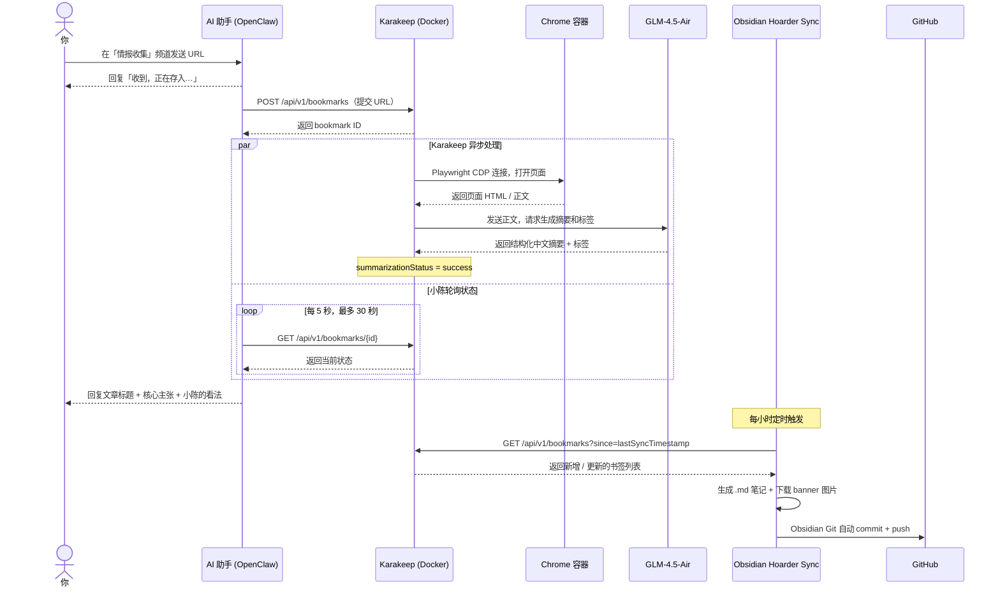

[English](README.md)

# 个人内容收集系统搭建指南

这个 repo 就是一份搭建指南，不是可以直接跑的程序。

说实话，工作了这些年，看过的文章记不住，收藏夹打开一次的都少。于是花了一些时间，把几个现成的工具拼在一起：在 Discord 频道发一个链接，OpenClaw 驱动的 AI 助手把它提交给 Karakeep——一个自托管的书签服务——Karakeep 爬取正文，调用 ZhipuAI 的 GLM-4.5-air 生成中文摘要，30 秒内回复到 Discord，同时自动同步进 Obsidian 笔记。

> **平台支持说明：** 目前主要验证过的是**微信公众号文章**。一般的网页（英文文章、博客、新闻）也能用。小红书因为网页版强制登录，Karakeep 无法直接爬取，暂不支持。

用下来觉得还行，就整理成文档分享出来。

**这不是开箱即用的工具。** 你需要跑一些命令、填一些配置、踩一些我已经踩过的坑（都记录在附录里了）。

如果你也：

- 看到好文章习惯性收藏，但收藏了就再也没打开过
- 想用 AI 整理信息流，但不知道从哪开始
- 可以接受折腾，但不想从头摸索

那可以参考这份指南。照着做不一定完全复现，但至少能少走一些弯路。

---

## 系统概述

这套东西分四层，每层干一件事：

| 层次 | 组件 | 职责 |
|---|---|---|
| 交互层 | Discord + AI 助手（OpenClaw） | 接收 URL、汇报摘要 |
| 处理层 | Karakeep（Docker） | 爬取正文、AI 生成摘要和标签 |
| 知识库层 | Obsidian + Hoarder Sync | 本地 Markdown 笔记，每小时同步 |
| 备份层 | Obsidian Git + GitHub | 自动版本控制和云备份 |

## 完整流程图

如果你想搞清楚每一步数据是怎么流转的，可以看这张图：



---

## 前置条件

开始之前先确认这几样东西都准备好了：

- macOS，已安装 Docker Desktop
- ZhipuAI 账号和 API Key（免费注册：https://open.bigmodel.cn）
- Obsidian 已安装

> **关于 GLM 模型选择：** ZhipuAI 新账户可用的模型为 `glm-4.5`、`glm-4.5-air`、`glm-4.6` 等。`glm-4.5-air` 性价比最高，本文使用此模型。文档中常见的 `glm-4-flash`、`glm-4-long` 在新账户中不可用。

---

## 第零步：准备 Discord Bot

这步是在浏览器里手动点的，不需要命令行，但有几个地方容易漏掉。

### 0.1 创建 Bot

1. 前往 https://discord.com/developers/applications → 点击 **New Application**，输入名称（如"情报助手"）→ Create
2. 左侧菜单 → **Bot** → 点击 **Reset Token** → 复制保存（**只显示一次，妥善保管**）

### 0.2 开启必要权限

在 Bot 页面下滑到 **Privileged Gateway Intents**，开启以下两项：

| Intent | 作用 |
|---|---|
| **Message Content Intent** | **必须开启**，否则 Bot 无法读取消息内容 |
| **Server Members Intent** | 推荐开启，用于成员权限控制 |

Message Content Intent 这个我当时就漏了，Bot 启动后死活收不到消息，查了半天才发现。

### 0.3 邀请 Bot 进入服务器

1. 左侧菜单 → **OAuth2** → **URL Generator**
2. **Scopes** 勾选：`bot`、`applications.commands`
3. **Bot Permissions** 勾选：`View Channels`、`Send Messages`、`Read Message History`、`Embed Links`、`Attach Files`
4. 复制页面底部生成的 URL，在浏览器新标签页打开
5. 选择你的服务器 → **授权**（需要服务器管理员权限）

---

## 第一步：部署 Karakeep

Karakeep 是整套系统的核心，负责爬取正文、生成摘要、存储数据。用 Docker 跑，三个容器（web、chrome、meilisearch），配好 `.env` 基本就能用。

### 1.1 创建配置文件

```bash
mkdir -p ~/karakeep && cd ~/karakeep
curl -o docker-compose.yml https://raw.githubusercontent.com/karakeep-app/karakeep/main/docker/docker-compose.yml
```

先生成两个随机密钥备用：

```bash
openssl rand -base64 36  # 用于 NEXTAUTH_SECRET
openssl rand -base64 36  # 用于 MEILI_MASTER_KEY
```

创建 `.env` 文件，这是配置最集中的地方，每个字段都有用，别漏：

```env
KARAKEEP_VERSION=release
NEXTAUTH_SECRET=<第一个随机密钥>
MEILI_MASTER_KEY=<第二个随机密钥>
NEXTAUTH_URL=http://localhost:3000

# 关键：绕过 Clash fake-ip 导致的 SSRF 拦截（见附录）
CRAWLER_ALLOWED_INTERNAL_HOSTNAMES=.

# ZhipuAI GLM 配置
OPENAI_API_KEY=<你的 ZhipuAI API Key>
OPENAI_BASE_URL=https://open.bigmodel.cn/api/paas/v4
INFERENCE_TEXT_MODEL=glm-4.5-air
INFERENCE_IMAGE_MODEL=glm-4.5-air
INFERENCE_OUTPUT_SCHEMA=plain
INFERENCE_LANG=chinese
INFERENCE_ENABLE_AUTO_SUMMARIZATION=true
INFERENCE_CONTEXT_LENGTH=8192
INFERENCE_MAX_OUTPUT_TOKENS=4096
CRAWLER_STORE_SCREENSHOT=false
```

> ⚠️ **`INFERENCE_OUTPUT_SCHEMA` 必须设为 `plain`**，不能用 `json`。GLM-4.5 系列会原样输出 `{"answer":"..."}` 导致摘要显示为 JSON 字符串。我在这里卡了挺久的。

> ⚠️ **不要配置 `HTTP_PROXY`/`HTTPS_PROXY`**。Clash 代理不稳定时会导致所有爬取全部失败，`CRAWLER_ALLOWED_INTERNAL_HOSTNAMES=.` 已能解决网络问题，无需代理。

### 1.2 启动服务

```bash
docker compose up -d
docker compose ps  # 确认三个容器（web、chrome、meilisearch）均为 Up
```

浏览器访问 http://localhost:3000，注册账号。

### 1.3 创建 API Key

1. 登录 Web UI → Settings → API Keys
2. 点击 "Create new API key"
3. 复制保存（只显示一次）

### 1.4 验证

跑一下这个命令，确认 Karakeep 能正常收到请求：

```bash
curl -X POST http://localhost:3000/api/v1/bookmarks \
  -H "Authorization: Bearer <your-api-key>" \
  -H "Content-Type: application/json" \
  -d '{"type": "link", "url": "https://example.com"}'
```

返回含 `"id"` 字段的 JSON 就说明通了。

---

## 第二步：配置 Obsidian

这步是让 Karakeep 存的内容自动同步到 Obsidian，顺便把 vault 备份到 GitHub。

### 2.1 安装插件

Obsidian 默认禁用第三方插件，先解锁：Settings → Community Plugins → 关闭 **Safe mode（安全模式）** → 点击 **Turn on community plugins**

开启后进入 Browse，分别搜索安装：

- **Hoarder Sync**：从 Karakeep 同步书签到 Obsidian
- **Obsidian Git**：把 vault 自动推送到 GitHub（第 2.4 节配置）

### 2.2 配置 Hoarder Sync

| 设置项 | 值 |
|---|---|
| API Key | 第一步中生成的 API Key |
| API Endpoint | `http://localhost:3000/api/v1` |
| Sync Folder | `00 收件箱`（或你喜欢的目录） |
| Sync Interval | `60`（分钟） |
| Update Existing Files | **开启** |

> ⚠️ **"Update Existing Files" 必须开启**。否则书签在 AI 处理完成前就被同步创建了，之后摘要更新了也不会写进文件里。这个默认是关的，容易忽略。

### 2.3 验证

命令面板执行 **Hoarder Sync: Start Sync**，检查同步目录下是否出现 `.md` 笔记文件。

### 2.4 配置 Obsidian Git（自动备份到 GitHub）

这步是把整个 vault 备份到 GitHub，不做也不影响基本功能，但做了之后不用担心本地数据丢失。

#### 2.4.1 在 GitHub 创建私有仓库

前往 GitHub → New repository，随便取个名字，设为 **Private**，不初始化任何文件，创建。

#### 2.4.2 生成 SSH Key 并添加到 GitHub

```bash
ssh-keygen -t ed25519 -C "your@email.com"
cat ~/.ssh/id_ed25519.pub  # 复制输出的内容
```

前往 GitHub → Settings → **SSH and GPG keys** → **New SSH key**，粘贴公钥保存。

#### 2.4.3 初始化 vault 并关联远程仓库

```bash
cd ~/your-vault           # 替换为你的 Obsidian vault 路径
git init
git remote add origin git@github.com:<用户名>/<仓库名>.git
```

#### 2.4.4 配置 Obsidian Git 插件

Obsidian → Settings → **Obsidian Git** → 改两个设置：

| 设置项 | 值 |
|---|---|
| Auto Commit Interval | `5`（分钟，0 表示禁用） |
| Auto Push | **开启** |

首次可以通过命令面板手动执行 **Obsidian Git: Commit all changes**，确认 SSH 连接没问题。

---

## 第三步：配置 AI 助手（OpenClaw）

这步是让 Discord 里的 AI 助手知道"收到 URL 该干什么"。我用的是 OpenClaw，如果你用其他方式提交 URL 可以跳过，逻辑是一样的。

### 3.0 安装 OpenClaw

```bash
brew install openclaw
```

配置 Discord 渠道：

```bash
openclaw config
```

交互式向导里：选择渠道类型 → **Discord** → 输入第零步保存的 Bot Token → 允许所有频道。

安装并启动 Gateway 服务：

```bash
openclaw gateway install
openclaw gateway start
```

验证：在 Discord 频道 @ 助手发消息，有响应就说明通了。如果没响应，先跑 `openclaw gateway status` 看看服务是否在跑。

### 3.1 在 Discord 创建频道

在服务器里新建一个专属频道，专门用来发待收藏的链接，和日常聊天分开。

### 3.2 配置 AI 助手行为

行为配置要写到两个文件里：**TOOLS.md** 放执行步骤，**AGENTS.md** 放触发条件和回复规则。

#### TOOLS.md：执行步骤

在 `~/.openclaw/workspace/TOOLS.md` 末尾追加：

```markdown
## 情报收集频道 → Karakeep

**频道：** `情报收集`（Discord channel ID: <你的频道ID>）

### 流程

**第一步：立刻回复**（不要等 exec 完成再说，先发出去）

**第二步：用 exec 执行提交脚本**

exec 参数：
- command: 下方提交脚本
- yieldMs: 10000
```

**提交脚本**（exec 1，拿到 ID 就退出，不等 AI 处理）：

```bash
API="<your-karakeep-api-key>"
URL_TO_SAVE="[用户发送的URL]"

ID=$(curl -s -X POST http://localhost:3000/api/v1/bookmarks \
  -H "Authorization: Bearer $API" \
  -H "Content-Type: application/json" \
  -d "{\"type\": \"link\", \"url\": \"$URL_TO_SAVE\"}" \
  | python3 -c "import sys,json; print(json.loads(sys.stdin.buffer.read().decode('utf-8'), strict=False).get('id',''))")

echo "BOOKMARK_ID: $ID"
```

继续在 TOOLS.md 追加：

```markdown
**第三步：拿到 BOOKMARK_ID 后，立刻用第二个 exec 轮询摘要**

exec 参数：
- command: 下方轮询脚本（把 BOOKMARK_ID_HERE 替换为上一步得到的 ID）
- yieldMs: 60000
```

**轮询脚本**（exec 2，每 5 秒查一次，最多 30 秒）：

```bash
API="<your-karakeep-api-key>"
ID="BOOKMARK_ID_HERE"

i=0
while [ $i -lt 6 ]; do
  sleep 5
  DATA=$(curl -s "http://localhost:3000/api/v1/bookmarks/$ID" \
    -H "Authorization: Bearer $API")
  STATUS=$(echo "$DATA" | python3 -c "import sys,json; print(json.loads(sys.stdin.buffer.read().decode('utf-8'), strict=False).get('summarizationStatus',''))")
  if [ "$STATUS" = "success" ]; then
    echo "$DATA" | python3 -c "
import sys, json, re
d = json.loads(sys.stdin.buffer.read().decode('utf-8'), strict=False)
title = (d.get('content',{}).get('title') or '').strip()
summary = (d.get('summary') or '').strip()
tags = [t['name'] for t in d.get('tags', [])]
m = re.search(r'\*\*核心主张\*\*\s*\n(.*?)(?=\n\n|\*\*)', summary, re.DOTALL)
zhuchang = m.group(1).strip() if m else ''
print('TITLE:', title)
print('ZHUCHANG:', zhuchang)
print('TAGS:', ', '.join(tags))
print('---FULL---')
print(summary)
"
    break
  fi
  i=$((i+1))
done
```

继续在 TOOLS.md 追加：

```markdown
**第四步：拿到输出后发第二条消息**

- TITLE → 文章标题
- ZHUCHANG → 核心主张（用自己的话转述，不要照抄）
- FULL → 完整摘要，读完后加上自己的看法
- 30 秒后仍是 pending → 回复「存进去了，AI 还在处理，等会儿 Obsidian 那边会有」
```

> ⚠️ **两个 exec 必须分开执行**，不能合并成一个。合并后轮询会卡住 Discord 消息监听器（30 秒硬超时），助手会长时间没响应。

#### AGENTS.md：触发条件与回复规则

在 `~/.openclaw/workspace/AGENTS.md` 末尾追加：

```markdown
## 情报收集频道：自动入库

当收到来自**情报收集**频道的消息时，无需任何触发词，直接执行以下流程。

### URL 消息

**第一步：立刻回复**（不等处理完成，先发出去）

**第二步：执行 TOOLS.md「情报收集频道 → Karakeep」的两个 exec 脚本**

**第三步：拿到摘要后，发第二条消息**，包含三个部分：
1. 用自己的话说核心是什么（不是照抄摘要）
2. 加上自己真实的反应——共鸣、质疑、联想，有观点，不说废话
3. 最后一行告知已存档、稍后同步 Obsidian

每次根据内容本身有不同的反应，不要让两条回复听起来像同一个模子刻出来的。

### 禁止：
- 禁止自行用 WebFetch、browser 抓取内容
- 禁止自行推送文件到 GitHub
```

---

## 常见问题

整理了一些搭的过程中我自己想到或者被问到的问题，分几类放在这里。

### 架构设计

### Q1. 为什么不直接用多个 Agent/Subagent 处理，而是引入 Karakeep？

其实我也想过这个问题。Agent 做一次性任务很合适，但这套系统需要的东西 Agent 天然给不了：

| 功能 | Karakeep 现成提供 | 纯 Agent 方案 |
|---|---|---|
| 正文爬取（含 JS 渲染） | Playwright 无头浏览器 | WebFetch 无法渲染 JS |
| AI 摘要 | 异步队列，后台处理 | 每次实时等待，API 费用翻倍 |
| 数据持久化 | PostgreSQL | 无，会话结束数据丢失 |
| 全文搜索 | Meilisearch 内置 | 不存在 |
| Obsidian 同步 | 插件直接对接 | 需自行开发 |
| 移动端 / 浏览器扩展 | 官方支持 | 无 |

简单说就是：Karakeep 是基础设施层，负责"存什么、怎么处理、存到哪"；AI 助手是交互层，负责"接收指令、汇报结果"。助手那 30 秒只是提交 + 轮询 + 格式化回复，真正的爬取和摘要在 Karakeep 的异步队列里跑，跟助手在不在线没关系。

### Q5. 两个 exec 分开跑是因为有 30 秒超时，这说明架构有问题吗？

说明的是 Discord API 对 Bot 响应的平台约束，不是这套方案的问题。所有 Discord Bot 框架都面临同样的软超时限制。把轮询拆成独立 exec 是在这个约束下的正常做法。

其实真正可以改进的是：让 Karakeep 处理完成后主动 webhook 通知助手，而不是让助手主动轮询。Karakeep 支持 webhook，只是还没配。

---

### 产品选择

### Q2. 为什么不用 Pocket / Instapaper / Readwise，要自己搭？

说实话，对大多数人来说，**Readwise Reader 可能是更好的选择**。

Readwise Reader 有移动 App、浏览器扩展、高亮标注、RSS 订阅、AI 摘要、全文搜索，功能完整度远超自建方案，价格是 $19.99/月（约 ¥1700/年）。

自建方案的真实优势只有三个：

- **数据所有权**：所有内容在本地，不依赖任何订阅服务存活
- **完全定制**：摘要 prompt、回复格式、触发行为可以随意改
- **成本**：只有 GLM API 按量费用，日常使用在个位数人民币/月

如果你不在意这三点，用 Readwise 更省事。选择自建是价值观判断，不是技术优越性。

---

### AI 质量

### Q3. AI 摘要准确吗？摘要说"作者认为 X 有益"，但原文是"X 被证伪了"，这种情况会发生吗？

会发生，有数据支撑。

根据 Vectara Hallucination Leaderboard（2025 年，基于 CNN/Daily Mail 831 篇文档的标准化摘要任务）：

| 模型类型 | 幻觉率 |
|---|---|
| 当前最优模型 | ~1.8% |
| 主流头部模型平均 | 3–8% |
| 多文档摘要最差情况 | 高达 75% |

GLM-4.5-air 属于中等规格模型，单文档摘要幻觉率预计在 5–10% 区间。

但这个问题要放在使用场景里看：这套系统的摘要是**入口筛选器**，不是原文替代。助手的回复让你判断"值不值得点开读原文"，不是让你直接引用摘要结论。如果你会把 AI 摘要当事实使用，这是使用方式的问题，不是系统的问题。

### Q4. GLM 生成的中文摘要，对英文原文的细节、反讽、语气处理得准吗？

不能保证，这是实话。GLM 系列是中文优化模型，处理英文细节时在以下场景容易出错：

- **反讽和幽默**：倾向于字面理解，忽略语气
- **不确定性修饰**：把"研究表明可能"压缩成"研究证明"
- **专业术语**：偶尔用近义词替换，改变精确含义

纯事实性文章（新闻、技术文档）准确率较高；观点性、文化性、讽刺性内容风险更大。

---

### 功能局限

### Q6. 摘要格式为什么是固定的"核心主张 + 标签"？不同内容类型应该用不同格式

这是真实的局限，也是可以改但还没改的地方。

固定格式是当时最快能用起来的方案。更合理的做法是根据内容类型动态调整：

- 论文 → 方法 + 结论 + 局限性
- 产品评测 → 优缺点 + 适合谁
- 新闻 → 事件 + 各方立场
- 观点文章 → 核心论点 + 依据 + 反驳空间

Karakeep 的摘要 prompt 在源码 `packages/shared/prompts.ts` 里可以直接改，属于 prompt engineering 的迭代，还没做到这一步。

### Q7. 收藏了很多文章后，能问助手"这篇和上周存的那篇有什么矛盾"吗？

目前不能自动做到。

现在能做的是主动触发搜索：`@助手 我存过关于 X 的内容吗` → 语义检索 → 返回相关条目 → 你再追问对比。不能做到的是：自动发现两篇文章之间的矛盾并主动推送。这需要入库时对新内容和历史条目做交叉比对，是功能缺失，不是设计哲学。

### Q8. 标签是 GLM 每次独立生成的，没有全局体系，会越来越乱吗？

会，这是现有系统最明显的缺陷之一。

同一个概念可能出现"machine learning"、"机器学习"、"ML"三个标签并存，搜索和过滤都没法关联它们。可行的改进：把现有标签列表注入摘要 prompt，让 GLM 优先复用；或者定期跑一个 agent 任务做聚类归并。属于已知待改进项，还没做。

### Q9. 系统是单向的：你发 URL，它存档。为什么没有反向推送？

这是真实的功能缺失。"文章有续集了"这类推送需要定期检测已收藏 URL 的更新、追踪作者新文章，超出了当前系统范围。技术上 OpenClaw 有 heartbeat 机制可以做，但监控所有收藏文章的更新成本比较高，还没有排进来做。


---

### 知识管理哲学

### Q10. 这个系统收集的是数据，不是知识。收藏了一千篇文章后能问"我的知识盲区在哪"吗？

目前不能直接问，而且这个问题是整套系统最值得警惕的地方。

心理学上有一个概念叫 **Collector's Fallacy（收藏者谬误）**：人类大脑会把"收藏"和"学习"混淆，收藏行为本身会触发多巴胺释放，产生"任务完成"的错觉，但实际上什么都没有内化。日语里有个词叫 **積ん読（Tsundoku）**，意思是买了书堆在那里不读。这套系统很可能是数字版 Tsundoku。

系统能做的是降低"存入"的摩擦，"消化"的摩擦必须由人自己承担。如果你从不打开 Obsidian 里的笔记，这套系统就只是一个更复杂的浏览器书签而已。

### Q11. Markdown 文件 + GitHub 是过时的知识管理方式，为什么不用向量数据库支持语义检索？

Markdown + Git 是刻意选择的约束，不是技术落后。

向量数据库的真实优势是语义检索，但代价是数据不可人工读写、调试困难、迁移成本高。实用的折中方案是两者并存：Markdown 存原始笔记，memsearch 对其建向量索引，这正是当前系统里已经在做的事。

Markdown + Git 的核心价值在于：**你能直接打开看你的知识库**。如果知识库只是向量，你对它的信任度和使用频率都会下降。可读性本身就是知识管理工具的重要指标。

### Q12. 既然有 AI 助手，为什么还需要人工手动发 URL？助手应该自动监控 RSS 和 Twitter 帮你筛选

手动发 URL 是刻意设计的摩擦。

自动化收藏的真实问题是 RSS 未读数会爆炸，最终导致"标记全部已读"然后放弃整个工具。手动发 URL 意味着你已经做了一次判断："这个值得存。"这个判断本身是一次信息筛选，也是一次浅层认知加工，对记忆有帮助。

自动监控 RSS 可以作为功能加入，但加了之后你需要面对"这堆自动存进来的东西我真的都要读吗"的问题。收藏的价值不在于多，在于你真的会用。

---

## Roadmap

当前系统已经可用，以下是从实际使用中整理出的改进方向，按难度排序。有些是已经知道该怎么做只是还没做，有些还没想清楚。

### 近期（配置/Prompt 层面，无需额外服务）

- [ ] **Webhook 替换轮询**：配置 Karakeep webhook，处理完成后主动通知助手，消除 exec 2 的等待时间
- [ ] **按内容类型动态摘要格式**：修改 `packages/shared/prompts.ts`，让 GLM 根据内容类型（论文 / 评测 / 新闻 / 观点）使用不同输出结构
- [ ] **全局标签注入**：将现有标签列表注入摘要 prompt，让 GLM 优先复用已有标签，减少标签碎片化

### 中期（需要新增功能模块）

- [ ] **跨文章语义对比**：入库时对新内容与历史条目做交叉比对，自动标记相关/矛盾的文章
- [ ] **反向推送**：通过 heartbeat 定期检测已收藏文章的更新，主动推送续集或引用
- [ ] **标签体系定期归并**：跑定时 agent 任务，对所有标签做聚类，合并同义标签

### 长期（架构层面扩展）

- [ ] **自动 RSS / Twitter 监控**：订阅信息源，由助手按兴趣模型筛选后自动入库，替代纯手动提交
- [ ] **知识盲区分析**：基于收藏内容的标签分布，识别覆盖稀疏的主题领域，定期生成报告

---

## 参考资料

- [Karakeep 官方文档](https://docs.karakeep.app)
- [Karakeep GitHub](https://github.com/karakeep-app/karakeep)
- [Obsidian Hoarder Sync 插件](https://github.com/jhofker/obsidian-hoarder)
- [ZhipuAI 开放平台](https://open.bigmodel.cn)

---

## 附录：踩坑记录

正常按上面步骤操作应该不会遇到这些问题，但如果有什么地方跑不通，可以来这里查一下。

### A1. 所有 URL 爬取失败：SSRF 防护拒绝访问保留 IP

**现象：** `crawlStatus` 均为 `failure`，日志报：
```
Refusing to access disallowed resolved address 198.18.x.x for host xxx.com
```

**原因：** Karakeep 内置 SSRF 防护，爬取前会做 DNS 解析。Clash Verge 默认用 `198.18.0.0/16` 作为 fake-ip 池，Docker 容器继承宿主机 DNS，外部域名解析到 fake-ip 后触发拦截。

**解决：** `.env` 中加一行：
```env
CRAWLER_ALLOWED_INTERNAL_HOSTNAMES=.
```
`.` 是通配符，匹配所有 hostname，跳过 DNS 解析和 IP 段检查。这是官方提供的配置项（issue #2285）。

---

### A2. 配置 Clash 代理后所有爬取失败

**现象：** 系统原本正常，某天起所有书签 `crawlStatus` 均失败，日志报：
```
Proxy connection ended before receiving CONNECT response
```
不只微信，连 Anthropic、GitHub 等也全部失败。

**原因：** `.env` 中配置了 `HTTP_PROXY` 指向 Clash。当 Clash 内部状态不稳定时，会接受 TCP 连接后立即中断 CONNECT 隧道，所有 HTTPS 请求失败，系统全面瘫痪。

**解决：** 彻底移除 `HTTP_PROXY`、`HTTPS_PROXY`、`NO_PROXY` 等代理配置，只保留 `CRAWLER_ALLOWED_INTERNAL_HOSTNAMES=.`。无论 Clash 开着还是关着，爬取都不受影响。

---

### A3. Obsidian 笔记中图片无法显示

**现象：** 笔记中有 `` 但图片加载失败。

**原因：** Obsidian 在 Electron 环境中无法直接渲染外部 URL 图片。

**解决：** Hoarder Sync 插件已在 PR #30 中修复（通过 Electron 的 `requestUrl` API 将图片下载到本地，生成 `![[wikilink]]` 格式）。该修复尚未合并到官方仓库，需手动安装 fork 版本：

```bash
git clone https://github.com/almendio-dev/obsidian-hoarder /tmp/obsidian-hoarder-fix
cd /tmp/obsidian-hoarder-fix
git checkout fix/image-rendering-obsidian
npm install && npm run build

PLUGIN_DIR="$HOME/<你的vault>/.obsidian/plugins/hoarder-sync"
cp "$PLUGIN_DIR/main.js" "$PLUGIN_DIR/main.js.bak"
cp /tmp/obsidian-hoarder-fix/main.js "$PLUGIN_DIR/main.js"
```

重启 Obsidian 生效。

---

### A4. 新书签同步到 Obsidian 后摘要为空

**现象：** Karakeep 里摘要已生成，但 Obsidian 笔记中 `summary` 为空。

**原因：** Hoarder Sync 在 AI 处理完成前就创建了文件，之后 `updateExistingFiles: false`（默认值）阻止了更新。

**解决：** 开启插件的 "Update Existing Files" 选项。已有的空文件需手动删除后重新同步。

---

### A5. AI 摘要误判近期时间（"2026年可能有误"）

**现象：** 摘要中出现类似"文章提到2026年，但当前是2023年，时间点可能有误"的内容。

**原因：** Karakeep 发送给 GLM 的 prompt 中未包含当前日期，模型按训练数据的时间感知（约2023年）判断。

**解决：** 修改 Karakeep 源码，在 `packages/shared/prompts.ts` 的 `constructSummaryPrompt` 函数中注入当前日期：

```typescript
const today = new Date().toISOString().split("T")[0];
// 在 prompt 规则中加一行：
// - Today's date is ${today}. Do NOT flag or question dates that are in the past relative to today.
```

修改后需本地构建 Docker 镜像。已向上游提交 PR #2529。

---

### A6. OpenClaw 助手更新后无法启动

**现象：** OpenClaw 自动更新后，助手无响应。

**原因：** launchd plist 指向了旧版本的路径，新版本安装后路径变了。

**解决：**
```bash
launchctl bootout gui/$UID/ai.openclaw.gateway
openclaw gateway install
```
